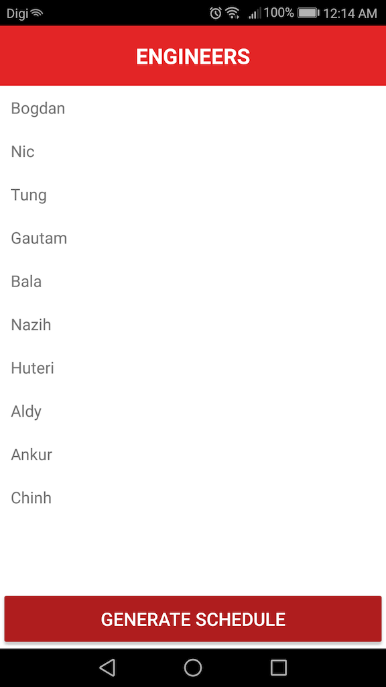
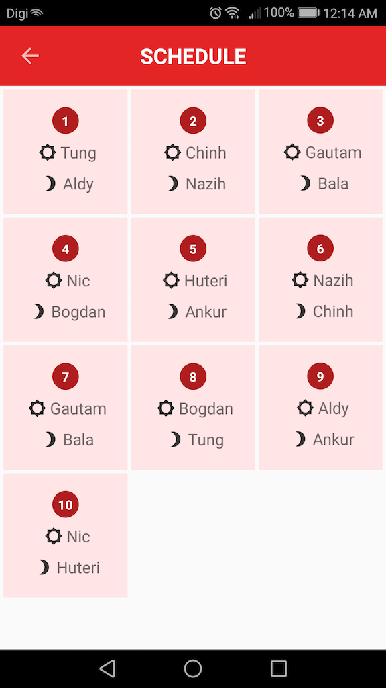

# Support Wheel of Fate - android

This is an app that should repeat selecting two engineers at random to both complete a half day of support (shift) each to ultimately generate a schedule that shows whose turn is it to support the business.

# APK
This apk with the build type (prod-debug)

Download <a href="https://drive.google.com/file/d/1iwT6Pc07J6gKgunJgzu4zMEzL3HNwRnf/view?usp=sharing">APK</a>

# Screenshots

# Installation
Clone this repository and import into Android Studio

git clone https://github.com/adi3246/isaandroidswf.git

# License
Copyright 2018 The Android Open Source Project, Inc.

Licensed to the Apache Software Foundation (ASF) under one or more contributor license agreements. See the NOTICE file distributed with this work for additional information regarding copyright ownership. The ASF licenses this file to you under the Apache License, Version 2.0 (the "License"); you may not use this file except in compliance with the License. You may obtain a copy of the License at

http://www.apache.org/licenses/LICENSE-2.0

Unless required by applicable law or agreed to in writing, software distributed under the License is distributed on an "AS IS" BASIS, WITHOUT WARRANTIES OR CONDITIONS OF ANY KIND, either express or implied. See the License for the specific language governing permissions and limitations under the License.
